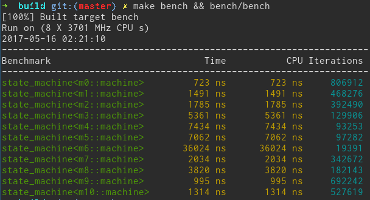

# rave
The goal is to implement a simple yet fast C++ state-machine. Writing boilerplate code is no fun, yet using the all-powerful Boost libraries (boost.statechart and boost.msm) may be an overkill in most applications. I usually resign to using the C-style switch-based state-machine, because it's fast, easy to debug, understand and reason about. 

This is the benchmarking results (using google benchmark library).


Now, what do these m1 ... m9 mean. 

## m1
The most primitive state machine imaginagle, just one stupid switch
```c++
switch (state)
{
case STATE_A:
    process_state_a(event); break;
case STATE_B:
    process_state_b(event); break;
};
```

## m2
My own state-machine generalization, I was trying to emulate the m1 machine with modern C++ adding some templates to the mix
```c++
template <class machine> struct state_a
{
   void react(event e)
   {
        process_state_a(event);
   }
};
template <class machine> struct state_b
{
    void react(event e)
    {
        process_state_b(event);
    }
};

class machine: public rave::machine<machine, state_a, state_b> {};
```

## m3
A C++ classic: using vtable dispatching and iterface classes
```c++
struct state
{
    virtual void react(event e) = 0;
};

struct state_a : public state {};
struct state_b : public state {};

struct machine
{
    state* current_state_;
    
    void react(event e)
    {
        current_state_->react(e);
    }
};
```

## m4
Another attempt in emulating the switch-based machine, but with std::function as a primary dispatching mechanism
```c++
```

## m5
A Boost.MSM statemachine. I feel the comparison would be incomplete without including this glorious piece of engineering in this review. Given all the power provided by MSM it works surprisingly fast. This is by far the best general-purpose state-machine written in C++ I've ever seen. 
```c++
#include <boost/msm/back/state_machine.hpp>
#include <boost/msm/front/state_machine_def.hpp>

struct event_a() {};
struct event_b() {};

class def : public msm::front::state_machine_def<def> 
{
    ...
};

using machine = boost::msm::back::state_machine<def>;

```

## m6
```c++
```

## m7
```c++
```

## m8
```c++
```

## m9
```c++
```


